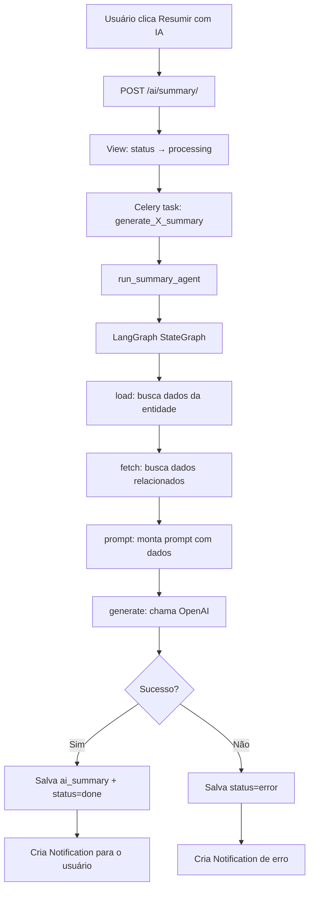
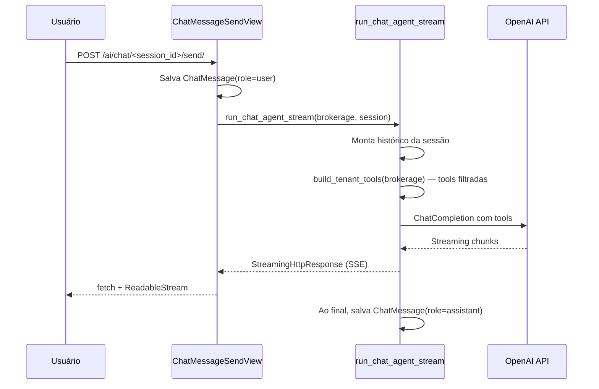

# Agentes de IA

## Visão geral

O módulo `ai_agents` implementa dois agentes baseados em LangGraph:

1. **Summary Agent** — gera resumos automáticos para Client, Proposal, Policy, Claim e Deal
2. **Chat Agent** — conversa com o usuário sobre a carteira do tenant, com acesso a tools de consulta

Ambos são **isolados por tenant**: as tools recebem a `brokerage` por parâmetro e filtram dados exclusivamente dela.

## Summary Agent

### Fluxo



### Models com AI Summary

| Model | Campo | Task Celery |
|---|---|---|
| `Client` | `ai_summary` | `generate_client_summary` |
| `Proposal` | `ai_summary` | `generate_proposal_summary` |
| `Policy` | `ai_summary` | `generate_policy_summary` |
| `Claim` | `ai_summary` | `generate_claim_summary` |
| `Deal` | `ai_summary` | `generate_deal_summary` |

### Status

```
idle → processing → done
                  → error
```

## Chat Agent

### Fluxo



### ChatSession e ChatMessage

- `ChatSession` — tenant-aware (`brokerage` FK), pertence a um `user`
- `ChatMessage` — ligada à `ChatSession` (sem `brokerage` direto — isolamento via parent)
- O usuário pode criar, renomear e excluir sessões
- O histórico é persistido e carregado como contexto

## Tools do Chat

`build_tenant_tools(brokerage)` retorna 11 tools isoladas:

| Tool | Descrição |
|---|---|
| `list_clients` | Lista clientes (filtra por nome/documento) |
| `get_client` | Detalhes de um cliente |
| `list_policies` | Lista apólices (filtra por status) |
| `get_policy` | Detalhes de uma apólice |
| `list_claims` | Lista sinistros (filtra por status) |
| `get_claim` | Detalhes de um sinistro |
| `list_proposals` | Lista propostas (filtra por status) |
| `get_proposal` | Detalhes de uma proposta |
| `list_deals` | Lista negociações CRM |
| `get_deal` | Detalhes de uma negociação |
| `get_dashboard_summary` | Resumo numérico do dashboard |

Todas as tools filtram por `brokerage=brokerage` — o tenant é injetado pelo servidor, nunca pelo modelo ou input do usuário.

## Custos e configuração

| Variável | Descrição | Default |
|---|---|---|
| `OPENAI_API_KEY` | Chave da API OpenAI | — |
| `OPENAI_MODEL` | Modelo usado para resumos e chat | `gpt-4o-mini` |

O modelo padrão é econômico (`gpt-4o-mini`). Para melhor qualidade em resumos, pode-se alterar para `gpt-4o` ou `gpt-4.5`.