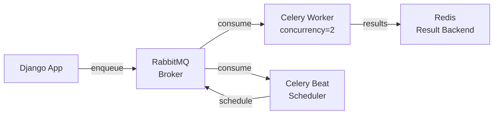

# Celery e Tasks

## Infraestrutura



## Configuração

```python
# settings.py
CELERY_BROKER_URL = env('CELERY_BROKER_URL')
CELERY_RESULT_BACKEND = env('CELERY_RESULT_BACKEND', default='redis://redis:6379/0')
CELERY_ACCEPT_CONTENT = ['json']
CELERY_TASK_SERIALIZER = 'json'
CELERY_RESULT_SERIALIZER = 'json'
CELERY_TIMEZONE = 'America/Sao_Paulo'
```

## Tasks por categoria

### Resumos de IA (ai_agents/tasks.py)

| Task | Trigger | Descrição |
|---|---|---|
| `generate_client_summary` | POST `/ai/summary/` | Gera resumo IA para Client |
| `generate_proposal_summary` | POST `/ai/summary/` | Gera resumo IA para Proposal |
| `generate_policy_summary` | POST `/ai/summary/` | Gera resumo IA para Policy |
| `generate_claim_summary` | POST `/ai/summary/` | Gera resumo IA para Claim |
| `generate_deal_summary` | POST `/ai/summary/` | Gera resumo IA para Deal |

Fluxo comum:
1. View seta `ai_summary_status = 'processing'`
2. Task chama `run_summary_agent()`
3. Em sucesso: salva `ai_summary` + `status='done'` + cria `Notification`
4. Em erro: seta `status='error'` + cria `Notification` de erro

### Renovações e ciclo (insurance/tasks.py via Beat)

| Task | Schedule | Descrição |
|---|---|---|
| `check_renewals_due` | Diário | Cria/atualiza renovações para apólices a vencer (30/60/90 dias) |
| `expire_policies` | Diário | Marca apólices vencidas como `expired` |

### E-mails (accounts/tasks.py ou core)

| Task | Trigger | Descrição |
|---|---|---|
| `send_email_task` | Qualquer envio | Envia e-mail via SMTP (password reset, notificações, etc.) |

## Celery Beat

Usa `django-celery-beat` com `DatabaseScheduler`. Os agendamentos são gerenciados via Django Admin (model `PeriodicTask`).

## Monitoramento

- **Admin:** `dj-celery-panel` registrado em `INSTALLED_APPS` — disponível em `/admin/celery/`
- **Flower:** não incluso por padrão (adicionar em produção se necessário)
- **Result backend:** Redis — permite rastrear status e resultado de cada task

## Docker Compose (desenvolvimento)

```yaml
celery_worker:
  build: .
  command: celery -A core worker -l info
  env_file: .env
  depends_on: [db, rabbitmq, redis]

celery_beat:
  build: .
  command: celery -A core beat -l info --scheduler django_celery_beat.schedulers:DatabaseScheduler
  env_file: .env
  depends_on: [db, rabbitmq, redis]
```

## Docker Swarm (produção)

```yaml
celery_worker:
  image: ghcr.io/pycodebr/scsi_v1:latest
  command: celery -A core worker -l info
  env_file: .env
  deploy:
    replicas: 2

celery_beat:
  image: ghcr.io/pycodebr/scsi_v1:latest
  command: celery -A core beat -l info --scheduler django_celery_beat.schedulers:DatabaseScheduler
  env_file: .env
  deploy:
    replicas: 1
```