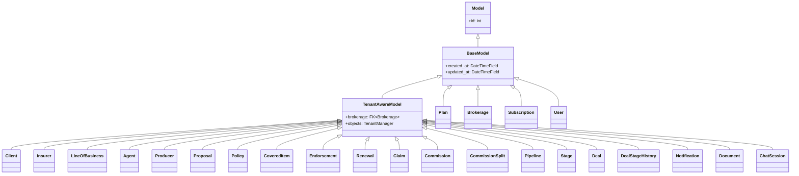

# Modelo de Domínio

## Diagrama ER

```mermaid
erDiagram
    Plan ||--o{ Brokerage : "brokerages"
    Brokerage ||--|| Subscription : "subscription"
    Brokerage ||--o{ User : "members"
    Brokerage ||--o{ Client : "clients"
    Brokerage ||--o{ Insurer : "insurers"
    Brokerage ||--o{ LineOfBusiness : "lines"
    Brokerage ||--o{ Agent : "agents"
    Brokerage ||--o{ Producer : "producers"
    Brokerage ||--o{ Pipeline : "pipelines"
    Brokerage ||--o{ Notification : "notifications"
    Brokerage ||--o{ ChatSession : "sessions"
    Brokerage ||--o{ Document : "documents"

    Client ||--o{ Proposal : "proposals"
    Client ||--o{ Policy : "policies"
    Client ||--o{ Deal : "deals"
    Insurer ||--o{ Proposal : "proposals"
    Insurer ||--o{ Policy : "policies"
    LineOfBusiness ||--o{ Proposal : "proposals"
    LineOfBusiness ||--o{ Policy : "policies"
    Agent ||--o{ Producer : "producers"
    Agent ||--o{ Proposal : "proposals"
    Agent ||--o{ Policy : "policies"
    Producer ||--o{ Proposal : "proposals"
    Producer ||--o{ Policy : "policies"

    Proposal ||--o{ Policy : "converted_policies"
    Proposal ||--o{ CoveredItem : "items"
    Proposal ||--o{ Deal : "deals"
    Policy ||--o{ CoveredItem : "items"
    Policy ||--o{ Endorsement : "endorsements"
    Policy ||--o{ Renewal : "renewals_original"
    Policy ||--o{ Claim : "claims"
    Policy ||--o{ Commission : "commissions"
    CoveredItem ||--o{ Claim : "claims"

    Commission ||--o{ CommissionSplit : "splits"

    Pipeline ||--o{ Stage : "stages"
    Stage ||--o{ Deal : "deals"
    Deal ||--o{ DealStageHistory : "histories"

    ChatSession ||--o{ ChatMessage : "messages"

    Plan {
        int id PK
        string name
        string slug UK
        decimal price
        bool is_available
        json features
    }
    Brokerage {
        int id PK
        string legal_name
        string trade_name
        string cnpj UK
        string susep_code
        string email
        bool is_active
    }
    Subscription {
        int id PK
        int brokerage_id FK_UK
        int plan_id FK
        string status
        datetime started_at
        datetime expires_at
    }
    User {
        int id PK
        string email UK
        string role
        int brokerage_id FK
    }
    Client {
        int id PK
        int brokerage_id FK
        string person_type
        string name
        string document
        string email
        string ai_summary
        string ai_summary_status
        bool is_active
    }
    Insurer {
        int id PK
        int brokerage_id FK
        string name
        string cnpj
        bool is_active
    }
    LineOfBusiness {
        int id PK
        int brokerage_id FK
        string name
        string code
        string category
        bool is_active
    }
    Agent {
        int id PK
        int brokerage_id FK
        string entity_type
        string name
        string document
        decimal default_commission_rate
        bool is_active
    }
    Producer {
        int id PK
        int brokerage_id FK
        int agent_id FK
        string entity_type
        string name
        decimal default_commission_rate
        bool is_active
    }
    Proposal {
        int id PK
        int brokerage_id FK
        int client_id FK
        int insurer_id FK
        string number UK
        string status
        decimal net_premium
        decimal total_premium
        string ai_summary
    }
    Policy {
        int id PK
        int brokerage_id FK
        int client_id FK
        int insurer_id FK
        string policy_number UK
        string status
        decimal net_premium
        decimal commission_rate
        date start_date
        date end_date
        string ai_summary
    }
    CoveredItem {
        int id PK
        int brokerage_id FK
        int proposal_id FK
        int policy_id FK
        string item_type
        decimal insured_amount
        json attributes
        json coverages
    }
    Endorsement {
        int id PK
        int brokerage_id FK
        int policy_id FK
        string endorsement_number
        string type
        string status
        decimal premium_change
    }
    Renewal {
        int id PK
        int brokerage_id FK
        int policy_id FK
        int new_policy_id FK
        string status
        date due_date
    }
    Claim {
        int id PK
        int brokerage_id FK
        int policy_id FK
        int covered_item_id FK
        string claim_number UK
        string status
        decimal claimed_amount
        decimal approved_amount
        string ai_summary
    }
    Commission {
        int id PK
        int brokerage_id FK
        int policy_id FK
        decimal insurer_rate
        decimal insurer_amount
        string status
    }
    CommissionSplit {
        int id PK
        int brokerage_id FK
        int commission_id FK
        int agent_id FK
        int producer_id FK
        string beneficiary_type
        decimal rate
        decimal amount
        string status
    }
    Pipeline {
        int id PK
        int brokerage_id FK
        string name
        bool is_default
    }
    Stage {
        int id PK
        int brokerage_id FK
        int pipeline_id FK
        string name
        string color
        int order
        bool is_won
        bool is_lost
    }
    Deal {
        int id PK
        int brokerage_id FK
        int pipeline_id FK
        int stage_id FK
        int client_id FK
        string title
        string status
        decimal estimated_value
        string ai_summary
    }
    DealStageHistory {
        int id PK
        int brokerage_id FK
        int deal_id FK
        int from_stage_id FK
        int to_stage_id FK
        string note
    }
    Notification {
        int id PK
        int brokerage_id FK
        int user_id FK
        string type
        string title
        bool is_read
    }
    ChatSession {
        int id PK
        int brokerage_id FK
        int user_id FK
        string title
    }
    ChatMessage {
        int id PK
        int session_id FK
        string role
        string content
    }
    Document {
        int id PK
        int brokerage_id FK
        int content_type_id FK
        int object_id
        string original_filename
        string mime_type
        int size
    }
```

## Hierarquia de models abstratos



## Padrão de AI Summary

Cinco models carregam o trio `ai_summary` / `ai_summary_status` / `ai_summary_updated_at`:

| Model | Status choices |
|---|---|
| `Client` | idle / processing / done / error |
| `Proposal` | idle / processing / done / error |
| `Policy` | idle / processing / done / error |
| `Claim` | idle / processing / done / error |
| `Deal` | idle / processing / done / error |

O fluxo de geração é assíncrono via Celery: o status transita de `idle` → `processing` → `done` (ou `error`).