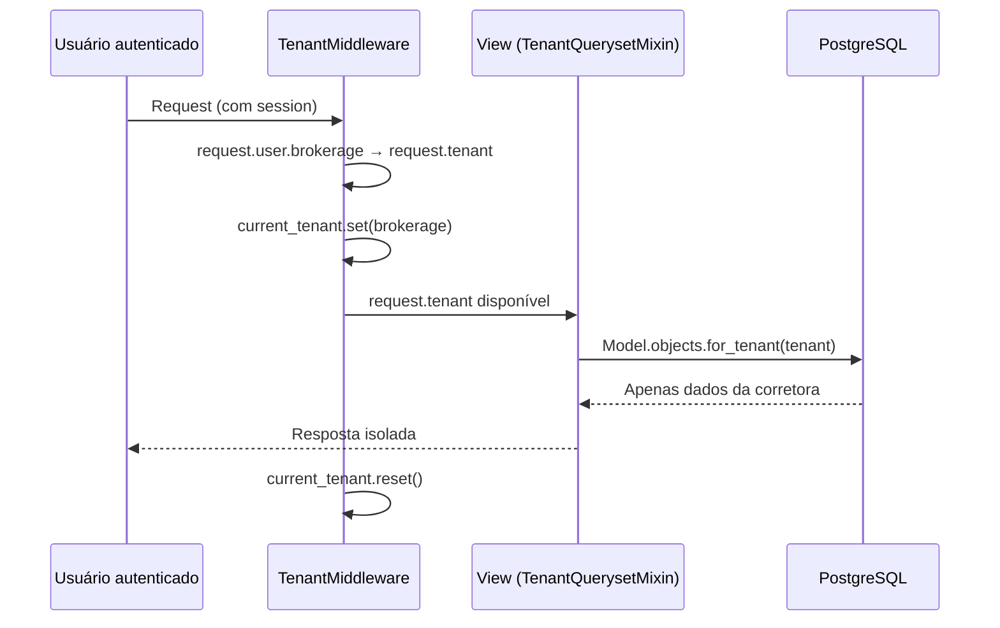

# Multi Tenant

## Estratégia de isolamento

O SCSI usa **isolamento por FK** (shared database, shared schema). Cada entidade sensível carrega a FK `brokerage`, e toda leitura filtrada automaticamente.

### Como funciona



## Componentes de isolamento

### 1. `TenantAwareModel` (base/models.py)

Modelo abstrato que adiciona `brokerage = FK('tenants.Brokerage', CASCADE)` e `objects = TenantManager()` a toda entidade de domínio.

### 2. `TenantMiddleware` (tenants/middleware.py)

Middleware que resolve `request.tenant` a partir de `request.user.brokerage` e seta a context var `current_tenant`. Usuários sem corretora recebem `None`.

### 3. `TenantQuerysetMixin` (base/mixins.py)

Mixin para CBVs que sobrescreve `get_queryset()` chamando `Model.objects.for_tenant(request.tenant)`. Se `tenant` for `None`, retorna queryset vazio.

### 4. `TenantManager` / `TenantQuerySet` (base/managers.py)

Manager customizado com `.for_tenant(brokerage)` que filtra por `brokerage`. Usado tanto nas views (via mixin) quanto em services/tasks (via context var).

### 5. Context var `current_tenant`

`ContextVar` que permite acessar o tenant ativo fora do escopo de request (ex: em Celery tasks, services). Setada pelo middleware e resetada no `finally`.

```python
# Em uma Celery task:
from base.managers import current_tenant

@shared_task
def generate_summary(model_name, object_id, brokerage_id):
    brokerage = Brokerage.objects.get(pk=brokerage_id)
    token = current_tenant.set(brokerage)
    try:
        # ... lógica isolada por tenant
    finally:
        current_tenant.reset(token)
```

## Regras inegociáveis

1. **Todo dado sensível filtra por `request.tenant`.** Nunca `request.user` direto para dados de negócio.
2. **Arquivos nunca são públicos.** `MEDIA_URL=/protected-media/` com view autenticada.
3. **IA recebe o tenant do servidor**, nunca do modelo ou do client.
4. **UniqueConstraints são compostos por `(brokerage, campo)`.** Ex: `(brokerage, document)` em `Client`, `(brokerage, policy_number)` em `Policy`.

## Índices compostos por tenant

Todos os índices de performance começam por `brokerage`:

```python
class Meta:
    indexes = [
        models.Index(fields=['brokerage', 'status']),
        models.Index(fields=['brokerage', 'created_at']),
    ]
```

Isto garante que o PostgreSQL use índices específicos por tenant em vez de escanear a tabela inteira.

## Models SEM `brokerage`

| Model | Motivo |
|---|---|
| `Plan` | Catálogo global de planos de assinatura |
| `Brokerage` | É o próprio tenant |
| `Subscription` | O2O com `Brokerage` (já está isolado) |
| `User` | `brokerage` nullable (onboarding, superadmin) |
| `ChatMessage` | Isolado via parent `ChatSession` (que tem `brokerage`) |